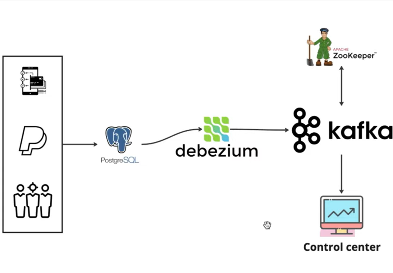

# Realtime Change Data Capture Streaming

## Overview

This project implements a real-time Change Data Capture (CDC) streaming pipeline
based on PostgreSQL, Debezium, and Kafka.

The objective is to capture database changes and stream them in real time
to downstream systems for processing and analytics.

---

## Architecture



The architecture is composed of the following layers:

1. Source database: PostgreSQL  
2. CDC engine: Debezium  
3. Streaming platform: Kafka  
4. Coordination: Zookeeper  
5. Monitoring: Kafka Control Center  
6. Processing layer: Spark, Flink, ksqlDB, Storm  
7. Analytics layer: Superset, Elasticsearch, Power BI, Tableau  

---

## Scope

In this project, we focus only on the **CDC and streaming layer**.
No business logic or application-specific processing is implemented.

---

## Core Components

### PostgreSQL

PostgreSQL is the source system.  
All data changes (INSERT, UPDATE, DELETE) are recorded in the WAL
(Write-Ahead Log).

---

### Debezium

Debezium acts as a CDC engine.  
It reads the PostgreSQL WAL using logical replication
and transforms each change into an event.

Debezium does not query tables directly.  
It only reads the transaction log.

---

### Kafka

Kafka receives all change events produced by Debezium.

Kafka acts as:
- a central event log,
- a buffer between producers and consumers,
- a distribution layer for downstream systems.

---

### Zookeeper

Zookeeper is used by Kafka for:
- cluster coordination,
- metadata management,
- broker leadership.

---

### Kafka Control Center

Kafka Control Center provides monitoring features such as:
- topic metrics,
- consumer lag,
- broker status,
- throughput.

---

## Change Data Capture Flow

1. An application writes data into PostgreSQL.  
2. PostgreSQL stores the change in the WAL.  
3. Debezium reads the WAL.  
4. Debezium publishes the event to Kafka.  
5. Kafka makes the event available to all consumers.  

---

## Kafka Producer and Consumer

### Producer (transaction_producer.py)

The producer is a Python application that:
- Connects to the source PostgreSQL database (financialDB)
- Fetches transactions from the `transactions` table
- Publishes each transaction as a JSON message to Kafka topic `transactions`
- Uses the `transaction_id` as the message key
- Implements delivery callbacks to track successful publications

---

### Consumer (transaction_consumer.py)

The consumer is a Python application that:
- Subscribes to the Kafka topic `transactions`
- Reads incoming transaction messages in real-time
- Connects to the destination PostgreSQL database (destinationdb)
- Creates the `transactions_sink` table if it doesn't exist
- Inserts each transaction into the destination database
- Uses `ON CONFLICT DO NOTHING` to avoid duplicate insertions

---

## How to Run the Project

### Prerequisites

- Docker  
- Docker Compose  

---

### Start the Platform

```bash
docker compose up -d
```

---

### Check Services

```bash
docker compose ps
```

---

### Access Services

**Kafka Control Center:**  
http://localhost:9021

**Debezium UI:**  
http://localhost:8080

**PostgreSQL:**  
localhost:5432

---

## PostgreSQL CDC Configuration

### Enable Full Row Capture

Connect to PostgreSQL:

```bash
psql -U postgres -d financialDB
```

Enable full row capture:

```sql
ALTER TABLE transactions REPLICA IDENTITY FULL;
```

---

## Trigger 1 – User Traceability

This trigger automatically stores who modified a row and when.

```bash
psql -U postgres -d financialDB 
```

```sql
create or replace function record_change_user()
returns trigger as $$
begin
  new.modified_by := current_user;
  new.modified_at := current_timestamp;
  return new;
end;
$$ language plpgsql;
```

```sql
create trigger trigger_user_update
before update on transactions
for each row
execute function record_change_user();
```

---

## Trigger 2 – Change History in JSON

This trigger stores old and new values in a JSON column.

```bash
psql -U postgres -d financialDB -c "alter table transactions add change_info jsonb;"
```

```bash
psql -U postgres -d financialDB 
```

```sql
create or replace function record_changed_columns()
returns trigger as $$
declare
  change_details jsonb;
begin
  change_details := '{}'::jsonb;

  if new.amount is distinct from old.amount then
    change_details := jsonb_insert(
      change_details,
      '{amount}',
      jsonb_build_object('old', old.amount, 'new', new.amount)
    );
  end if;

  change_details := change_details ||
    jsonb_build_object(
      'modified_by', current_user,
      'modified_at', now()
    );

  new.change_info := change_details;
  return new;
end;
$$ language plpgsql;
```

```sql
create trigger trigger_record_change
before update on transactions
for each row
execute function record_changed_columns();
```

---

**Example Result:**

```json
{
  "amount": { "old": 200, "new": 800 },
  "modified_by": "postgres",
  "modified_at": "2026-02-01T18:42:31"
}
```

---

## Decimal Problem in Debezium

**Problem:**

Decimal fields appear like this in Kafka:
```json
"amount": { "scale": 2, "value": "AAAB9A==" }
```

Instead of:
```json
"amount": 459.38
```

---

**Cause:**

By default, Debezium uses:
```
decimal.handling.mode = precise
```

This encodes decimals in binary (base64).  
This is correct for strict finance,
but not practical for analytics and dashboards.

---

**Fix Decimal Format:**

```bash
curl -X PUT http://localhost:8093/connectors/postgres_connector/config \
  -H "Content-Type: application/json" \
  -d '{
    "connector.class": "io.debezium.connector.postgresql.PostgresConnector",
    "topic.prefix": "cdc",
    "database.user": "postgres",
    "database.password": "amal",
    "database.dbname": "financialDB",
    "database.hostname": "postgres",
    "database.port": "5432",
    "plugin.name": "pgoutput",
    "decimal.handling.mode": "double"
  }'
```

```bash
curl -X POST http://localhost:8093/connectors/postgres_connector/restart
```

---

**Result:**

Before:
```json
"value": "AAAB9A=="
```

After:
```json
"amount": 459.38
```

---

**Connector Rules:**

- Connector does not exist → `POST /connectors`  
- Connector exists already → `PUT /connectors/{name}/config`  
- Configuration changed → `PUT + restart`  

---

**Decimal Modes:**

- `precise` → bytes/base64 → strict finance  
- `string` → "459.38" → simple json  
- `double` → 459.38 → analytics / streaming  

---

## Stop the Platform

```bash
docker compose down
```

---

## Conclusion

This project demonstrates a basic but realistic
real-time CDC streaming architecture using
PostgreSQL, Debezium, and Kafka.

It reflects the core principles of log-based data capture
and event-driven data pipelines.
